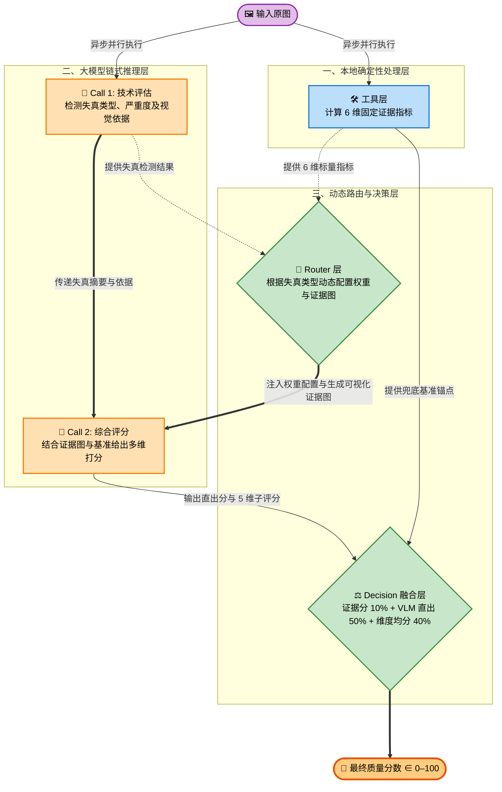

# 基于多模态大模型的零样本图像质量评估 Agent（v0.19）

> 评测数据集：KonIQ-10k 验证集（2015 张）、SPAQ 测试集（1125 张）  
> 评测指标：SRCC（越高越好）、MAE（越低越好）  
> 骨干模型：Qwen2.5-VL-7B-Instruct（本地 vLLM 部署）

---

## 方案简介

本项目提出一套基于多模态大语言模型（MLLM）的零样本 IQA Agent 框架，核心设计是**本地确定性工具层基准 + VLM 链式感知校正**。

系统在推理阶段不接触任何来自目标评测集的标注信息，仅通过 Skill Prompt 将规则、流程和评分标准注入大模型，所有工具层参数均为固定工程阈值。



---

## 最终评测结果

| 数据集 | 样本数 | SRCC ↑ | MAE_100 ↓ | MAE_native ↓ |
|:------|:------:|:------:|:---------:|:------------:|
| KonIQ-10k 验证集 | 2015 | **0.6709** | 19.89 | 0.7956（1–5 尺度） |
| SPAQ 测试集 | 1125 | **0.7499** | 14.85 | 1.485（0–10 尺度） |

---

## 核心设计

### 工具层（6 维固定证据）

全部在本地 CPU 执行，不依赖任何数据集统计：

| 维度 | 说明 |
|------|------|
| 全局/局部梯度清晰度 | 全图及四角 128×128 块的 Laplacian 方差，取最差块作为下限 |
| 噪声严重度 | 原图与高斯去噪版本的残差标准差，固定上限归一化 |
| BRISQUE 质量指数 | 基于 NSS 的盲参考评估，不可用时自动重归一化其余权重 |
| 曝光质量 | 亮度偏离惩罚 + 高光/暗角裁剪像素比 |
| 块状效应 | 8×8 块边界梯度异常，量化 JPEG 压缩伪影 |
| 多尺度可视化证据图 | 梯度图 + 噪声残差图 + 六宫格细节接触表（全图+四角+中心） |

### 双阶段 VLM 链式推理

- **Call 1 — 技术评估**：封闭集合 7 类失真检测，同时输出严重程度与可见视觉依据，与工具层并行执行（asyncio.gather）
- **Call 2 — 综合评分**：结合原图、证据图、工具标量及评估摘要，输出 0–100 分数与 5 维技术评分（sharpness / noise_cleanliness / exposure / color_fidelity / artifact_free）

### 分数融合公式

$$\text{score} = 0.10 \cdot \text{evidence} + 0.50 \cdot \text{vlm\_direct} + 0.40 \cdot \text{vlm\_dimensions}$$

evidence_anchor 仅作兜底保险（10%），VLM 判断主导最终得分。

---

## 快速开始

### 1. 环境安装

```bash
python -m venv .venv
source .venv/bin/activate   # Windows: .venv\Scripts\activate
pip install -r requirements.txt
```

### 2. 模型权重

百度网盘下载：[Qwen2.5-VL-7B-Instruct](https://pan.baidu.com/s/1_uI7efZx6k6IqP7fsgPeKA?pwd=t84h)（提取码：t84h）

也可从公开渠道下载：
- HuggingFace：`Qwen/Qwen2.5-VL-7B-Instruct`
- ModelScope：`qwen/Qwen2.5-VL-7B-Instruct`

### 3. 启动 vLLM 服务

```bash
nohup python -m vllm.entrypoints.openai.api_server \
  --model /path/to/Qwen2.5-VL-7B-Instruct \
  --port 8000 \
  --max-model-len 4096 \
  --limit-mm-per-prompt '{"image": 4}' \
  > vllm.log 2>&1 &
```

v0.19 客户端在发送前已将图片限制在 262144 像素以内，KonIQ 和 SPAQ **使用同一套启动参数**，无需 `--mm-processor-kwargs`。

### 4. 运行评测

```bash
# KonIQ-10k 验证集全量
python evaluation/run_eval.py --dataset koniq --vlm server \
  --base-url http://<SERVER>:8000/v1 \
  --model /path/to/Qwen2.5-VL-7B-Instruct \
  --images-dir /path/to/koniq/512x384 \
  --labels-csv data/koniq/koniq10k_val.csv \
  --label-min 1 --label-max 5 --workers 3

# SPAQ 测试集全量
python evaluation/run_eval.py --dataset spaq --vlm server \
  --base-url http://<SERVER>:8000/v1 \
  --model /path/to/Qwen2.5-VL-7B-Instruct \
  --images-dir /path/to/SPAQ/TestImage \
  --labels-csv data/spaq/spaqTest.csv \
  --label-min 0 --label-max 10 --workers 3
```

---

## 目录结构

```
IQAagent_v19/
├── pipeline.py                # 主评测管道
├── precompute.py              # 离线预计算（可选）
├── router/tool_selector.py    # Router + Decision 融合
├── tools/                     # 6 维证据指标计算
├── skills/
│   ├── vlm_client.py          # VLM 适配器（含客户端缩图逻辑）
│   └── prompts.py             # 两阶段 Prompt
├── evaluation/
│   ├── run_eval.py            # 批量评测入口，支持断点续跑
│   └── metrics.py             # SRCC / MAE 离线计算
├── data/                      # 数据集 label CSV（不含图片）
├── results/                   # 各版本评测结果 CSV
├── tests/                     # 单元测试（13 项）
├── 实验报告.md
└── 复现指南.md
```

---

## 合规说明

| 条款 | 状态 | 实现方式 |
|------|:----:|---------|
| 禁止评测数据训练 | ✅ | 所有工具参数为固定工程阈值 |
| 仅通过 Skill 注入规则 | ✅ | 规则和评分标准仅通过 Prompt 传入 VLM |
| Router 可优化 | ✅ | Router 仅根据当前图片失真结果选择规则 |
| 禁止数据集捷径 | ✅ | 在线 Pipeline 不接收文件名/ID；缓存键为 SHA-256 内容哈希 |
| MOS 不进入推理 | ✅ | MOS 仅用于离线指标计算 |

详细说明见 [实验报告.md](实验报告.md) 和 [复现指南.md](复现指南.md)。
